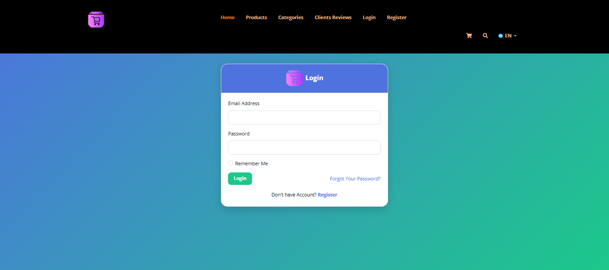
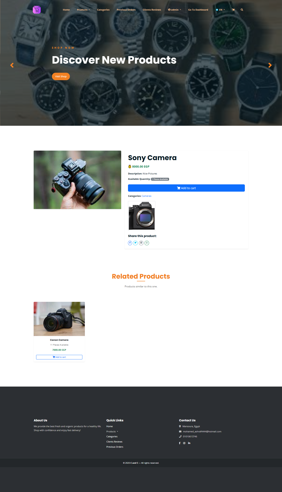
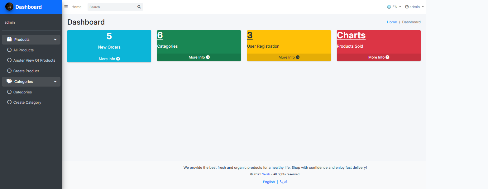
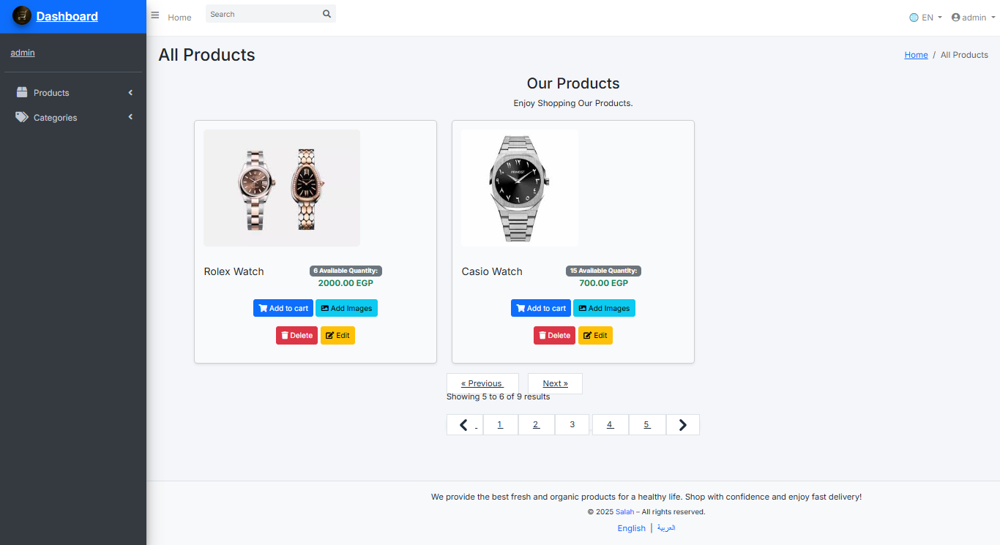
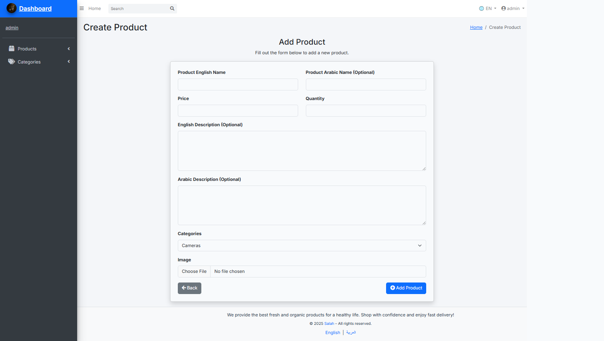

# 🛍️ Laravel E-Commerce Website

A simple yet elegant **E-Commerce web application** built using **Laravel**, featuring a multilingual interface (Arabic / English), user authentication, and a clean admin dashboard for managing products.

---

## 🚀 Features

### 👤 Authentication System
- Register, Login, Logout  
- Email Verification  
- Password Reset & Forgot Password pages  
- Fully customized UI for auth pages (Login, Register, Reset, etc.)

### 🌐 Multilingual Support
- Supports **Arabic (RTL)** and **English (LTR)**  
- Dynamic direction and text changes based on language  
- Language switcher integrated in the layout  

### 🛒 Products Management
- Display all products  
- Product details page with description, price, and images  
- Admin can:
  - Add new products  
  - Edit existing products  
  - Delete products  
  - Upload multiple images for each product  
- Related products section for better UX  

### 💬 User Interface
- Modern and responsive design using **Bootstrap 5**  
- Dynamic hero section with carousel images  
- Social media sharing buttons (Facebook, Twitter, LinkedIn, WhatsApp)  
- Elegant color theme (Blue & Green)  
- RTL/LTR optimized layouts  

---

## 🧠 Technologies Used

| Category | Technology |
|-----------|-------------|
| Backend | Laravel (PHP Framework) |
| Frontend | Blade Templates, Bootstrap 5, CSS |
| Localization | Laravel Lang System |
| Auth | Laravel Breeze / Auth Scaffolding |
| Version Control | Git & GitHub |

---

## ⚙️ Installation

1. **Clone the Repository**
   ```bash
   git clone https://github.com/your-username/ecommerce-laravel.git
   cd ecommerce-laravel

2. **Install Dependencies**
   composer install
   npm install
   
3. **Setup Environment**
   cp .env.example .env
   php artisan key:generate

4. **Database Setup**  
   1. Create a database (MySQL / MariaDB)
   2. Update .env file with your DB credentials
   3. Run migrations: php artisan migrate
   4. (Optional) Seed some sample data: php artisan db:seed
      
5. **Build Frontend Assets**
   npm run dev   # for development
   npm run build # for production

6. **Run the Server**
   php artisan serve

7. **Access the app**
    Open your browser and go to:
       👉 http://127.0.0.1:8000
   
   
 ## 📸 Screenshots
   **Login Page**  
        
        
   **Product Details**  
        
        
   **Admin Dashboard**  
        

   **Products Actions**
        

   **Create Product**
       

## 🧩 Folder Structure Overview
       app/
     ┣ Controllers/
     ┣ Models/
     ┣ Middleware/
    resources/
     ┣ views/
     ┃ ┣ auth/           # Login, Register, Reset, etc.
     ┃ ┣ layouts/        # Main layouts (parent, admin, auth)
     ┃ ┗ products/       # Product views
     ┣ lang/
     ┃ ┣ ar/messages.php
     ┃ ┗ en/messages.php
    routes/
     ┗ api.php
     ┗ web.php
    public/
     ┣ assets/
     ┣ uploads/
    screeenshots/
      
## ⚠️ Notes
   - Make sure your PHP version is 8.3.16+ for Laravel 12
   - Ensure Node.js & npm are installed for building assets
   - Images in screenshots/ folder must match the filenames in the Markdown

## 🧑‍💻 Author
 **Mohamed Ashraf**  
  📧 Email: mohamed_ashraf4444@hotmail.com  
  🌐 GitHub: [https://github.com/salah3122001](https://github.com/salah3122001)  
  🔗 LinkedIn: [https://www.linkedin.com/in/mohamed-ashraf-14916a367](https://www.linkedin.com/in/mohamed-ashraf-14916a367)
       

---
   